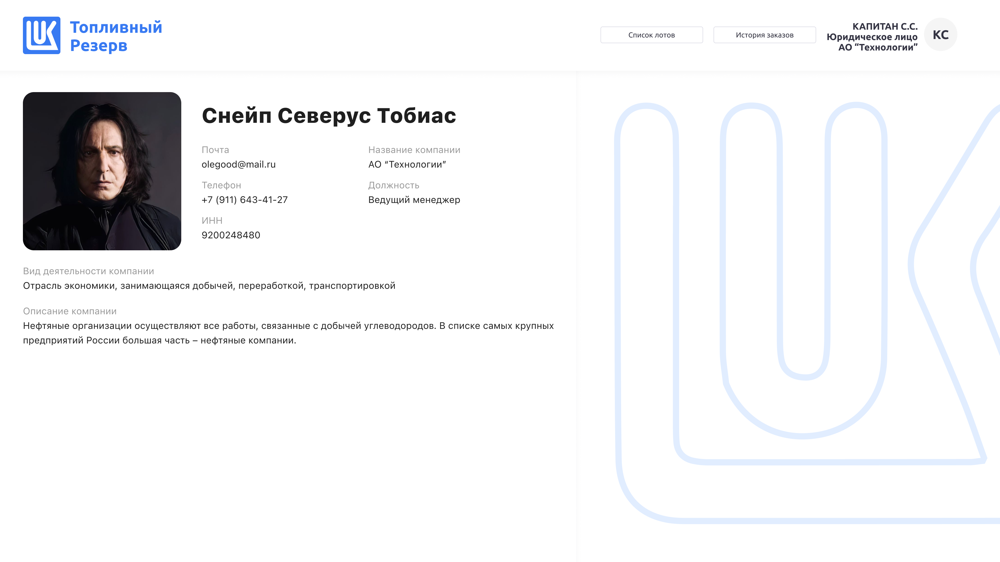

# Система для онлайн-продаж лотов топлива

Ссылка на презентацию: [https://docs.google.com/presentation/d/1GnA2e5HWBv6K_yVPF1bXXdY26Hs-RBxCnLLRg7sRofQ/edit](https://docs.google.com/presentation/d/1y0nCuOZSu76ptC7B3lfnaMzlNN-Q3lCP/edit#slide=id.p1)

Макет figma: https://www.figma.com/design/3KNlXaHJXAH6eUyQOBtaWT/%D0%90%D1%82%D0%BE%D0%BCDev%23?node-id=0-1&p=f&t=LDu25NL6LnNLD4XA-0

## Docker и docker-compose находятся в репозитории.

Это позволит запустить сервис вместе с бэкендом одной командой docker-compose.

В настоящий момент фронтенд развернут на сервере по адресу:
Развертывание бэкенда

Docker и docker-compose находятся в репозитории.

Необходимо склонировать репозиторий, перейти в его папку и запустить docker-compose up. Это автоматически развернет базу данных postgres и бэкенд на Java.

В настоящий момент бэкенд развернут на сервере: https://skoltech-hackathon-prod.vercel.app/auth-pages/login

Его swagger размещен по адресу Swagger: http://vk-atom-dev.ru/swagger-ui/index.html.

## Описание архитектуры и модели данных

Используется клиент-серверная архитектура, взаимодействие между сервисами по REST API. Бэкенд реализован на Java с использованием фреймворка Spring Boot и системы сборки Maven. База данных - Postgres. Фронтэнд реализован на React.js, с использованием Next.js и Ant Design.

Авторизация в системе осуществляется с использованием JWT - токенов. Токен формируется с использованием алгоритма шифрования HS512.

Основные сущности базы данных - это лоты, заказы и пользователи.  В качестве справочных enum значений представлены сущности Типа топлива, Нефтебазы, Способа доставки и Статуса. При этом статус и стоимость лота не хранятся в базе данных напрямую. Значения свойств вычисляется исходя из других значений.

# Описание функционала

## Разработанный функционал БЭК-офиса

### Импорт данных из файла
Реализована возможность загрузки лотов из csv в систему путем импорта файла и парсинг его в нужные таблицы. Действие может быть произведено через специальный метод импорта на странице администратора, а также через сваггер. Если в каком-то столбце нет данных - строка пропускается.
Пример csv файла для загрузки приложен в репозитории.

### Передача лотов на портал
Система по запросу со стороны Фронт-офиса автоматически передает информацию о доступных лотах на портал, где они отображаются для потенциальных покупателей. Обеспечена возможность передачи как списка всех лотов, так и детальной информации по конкретному лоту.
Передаются только лоты в статусе «Подтверждён». Лоты в статусах «Продан» и «Неактивен» исключаются.
Передача списка лотов происходит с учетом пагинации, фильтрации по 2 полям и поиска по 3 полям, реализованных в соответствии с требованиями.
При запросе информации по конкретному лоту происходит расчет суммы всех имеющихся в системе остатков по данному виду топлива для данной нефтебазы. Таким образом, покупатель может оценить, насколько представленный ресурс является редким.

### Создание заказа с портала
Реализован процесс создания заказов на покупку топлива через портал. При создании заказа выполняется проверка заказываемого кол-ва топлива и реального доступного остатка соответствуем лоте.  Проверка выполняется и на фронтэнде, и на бэкенде, что позволяет обеспечить консистентность базы данных даже при одновременном осуществлении транзакций несколькими пользователями.
При успешном создании заказа производится обновление доступного остатка связанного с заказом лота. При ошибочном создании заказа возвращается ошибка.

## Разработанный функционал портала Фронт-офис

### Авторизация и регистрация клиента на портале

При запуске отображается экран авторизации по логину пользователя и его паролю. Реализована проверка на корректность пароля с выводом сообщения о его некорректности. Если пользователь не зарегистрирован, у него есть возможность перейти на страницу регистрации и сделать это.
После прохождения авторизации открывается экран главной страницы портала. 
### Просмотр, поиск и фильтрация лотов

При переходе на страницу маркетплейса (или обновлении страницы) выполняется запрос на получение подтвержденных лотов из системы. 
Каждый лот содержит все необходимые данные.
Во фронт-офисе используется справочник соответствия:  
·       кодов КССС НБ и названий нефтебаз,
·       кодов КСС топлива и видов топлива. 

Поиск лота выполняется по трем параметрам (как было указано в задаче):
·       Виду топлива
·       Названию нефтебазы
·       Региону нефтебазы

Фильтрация выполняется по двум параметрам:
·       Виду топлива
·       Названию нефтебазы

### Процедура оформления заказа

При оформлении покупки информация о покупаемом лоте передается в систему (бэк-офис), одновременно запрашивается остаток топлива по лоту. Если остатка недостаточно (кто-то уже опередил), то возвращается сообщение об ошибке.

Если остатка топлива по лоту достаточно, то покупка оформляется и в систему (бэк-офис) передается информация об уменьшении остатка топлива по лоту.

Покупка нескольких разных видов топлива с одной нефтебазы оформляется несколькими заказами.

### Реализована страница со списком всех совершеных заказов пользователем

### Личный кабинет, профиль

 

